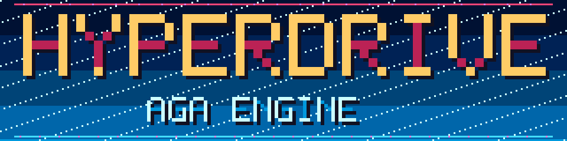
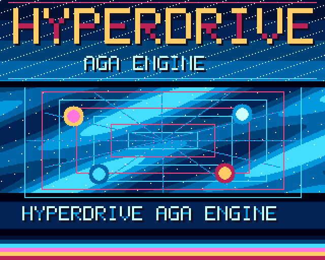
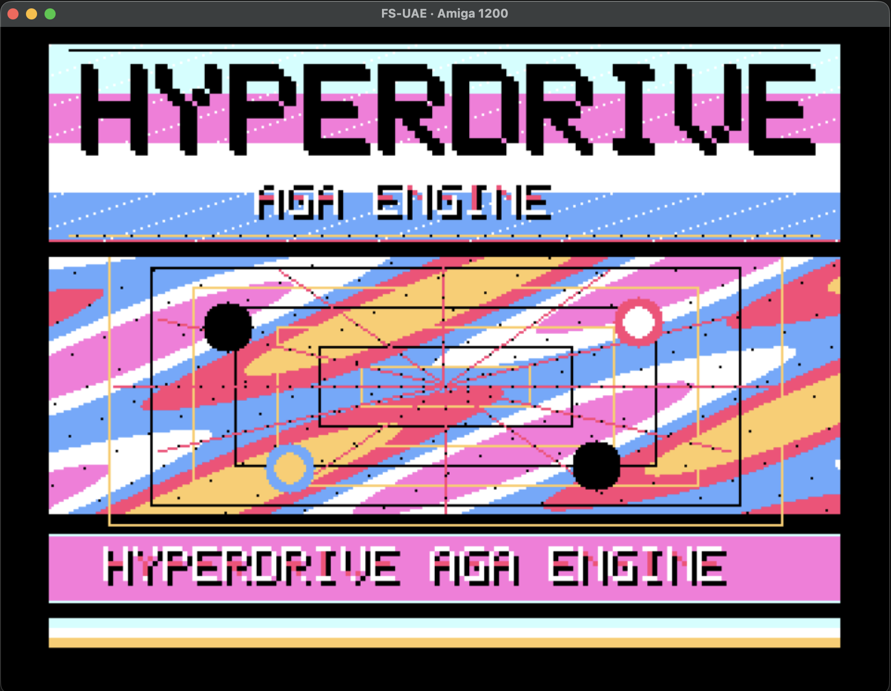

# AGA Hyperdrive Engine

**AGA Hyperdrive Engine** is a new-from-scratch Amiga AGA effects engine aiming for state-of-the-art PAL Amiga 1200/4000 visuals while staying original, reproducible and hardware-conscious.

The current revision is a complete first full demo engine: deterministic full-screen art, generated music, raw Paula playback, generated 24-bit AGA palettes, Copper effect slots, a persistent frame loop, sprite/orb state, tunnel/plasma/floor layers, validation tooling and a classic hunk build path. It is built to push AGA hardware with reusable effect-graph structure instead of a single hard-coded intro.





## FS-UAE test run



## Design goals

- Maximise AGA capability with 24-bit Copper gradients, palette banking, sprite layers and blitter/vector workloads.
- Keep the CPU path 68000-compatible where practical, with a clear route for 68020/A1200 optimisations.
- Make every generated asset reproducible from source.
- Build a reusable effect graph rather than one-off scene code.
- Keep music in-repo: generated ProTracker-compatible module data with bass, lead, glass, kick, snare and hat instruments.
- Play a generated signed 8-bit Paula loop directly from the runtime so the bootable target has sound without external files.
- Validate structure, assets and release manifests on the host.

## Engine layers

| Layer | Purpose | Current state |
| --- | --- | --- |
| Startup | AGA gate, OS-safe entry/exit | isolated gate and clean structure |
| Copper | Display setup and AGA colour slots | 32 live 24-bit slots plus generated gradients |
| Bitmap | Four-plane 320×256 screen storage | deterministic full-screen planar art |
| Art/GFX | Logo, plasma band, tunnel ribs, orbs, status panel and floor | generated `assets/screen.raw` and preview PNG |
| Plasma | 256-colour 24-bit AGA ramp | generated binary table |
| Tunnel | Reciprocal camera/projection table | generated binary table |
| Music | Four-channel MOD data plus runtime Paula loop | generated `assets/hyperdrive.mod` and `assets/audio_loop.raw` |
| Validation | Asset/source/manifest sanity | `make validate`, reproducibility, manifest |

## Build

```sh
make validate
make verify-repro
make
make floppy-turbo
```

The full executable build requires `vasmm68k_mot` on `PATH` or at `tools/bin/vasmm68k_mot`.

Output:

```text
build/aga_hyperdrive_engine
build/floppy_turbo/
build/aga_hyperdrive_turbo.adf   # optional, only when xdftool exists
```

## Generate assets

```sh
make assets
python3 tools/generate_assets.py
python3 tools/gen_tables.py plasma_palette
python3 tools/gen_tables.py copper_gradient
python3 tools/gen_tables.py tunnel
```

Generated assets:

- `assets/logo.raw`
- `assets/logo_preview.png`
- `assets/screen.raw`
- `assets/screen_preview.png`
- `assets/audio_loop.raw`
- `assets/hyperdrive.mod`
- `assets/plasma_palette.bin`
- `assets/copper_gradient.bin`
- `assets/tunnel.bin`

## Run target

Use FS-UAE/WinUAE/Amiberry with an A1200 or A4000 AGA PAL configuration. The executable displays generated full-screen planar art through real Copper bitplane pointers, runs live AGA colour-slot updates, advances tunnel/orb/scene/music state every frame, starts Paula channel 0 playback from `assets/audio_loop.raw`, and stays running until the left mouse button is pressed.

## Validation

```sh
make validate
python3 tools/verify_repro.py
python3 tools/make_manifest.py
shasum -a 256 -c MANIFEST.sha256
```

## Implemented effects

- Hyperdrive plasma lattice: per-line AGA colour writes plus sub-frame palette phase modulation.
- Tunnel layer: reciprocal-table camera/depth modulation plus static wire ribs in the generated screen layer.
- Energy orbs: generated shaded orb art plus live sprite/orb control state.
- Morphing logo material: Copper glint, per-row scroll and dynamic colour-bank swaps.
- Music-reactive scene graph: row/tick-style event pulses drive plasma intensity, tunnel speed and sprite bursts.
- Full-screen generated art: logo, aurora/plasma band, tunnel ribs, orb art, status panel and floor bars.

## License

GPL-3.0-or-later. See `LICENSE`.
